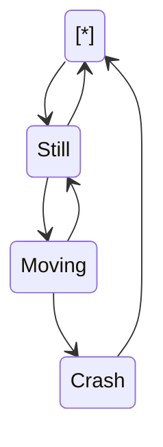

Test test

<br/>

<!--MERMAID {width:100}-->

<!--MCONTENT {content: "stateDiagram-v2<br/>\n\\[\\*\\] \\-\\-\\> Still<br/>\nStill \\-\\-\\> \\[\\*\\]<br/>\nStill \\-\\-\\> Moving<br/>\nMoving \\-\\-\\> Still<br/>\nMoving \\-\\-\\> Crash<br/>\nCrash \\-\\-\\> \\[\\*\\]<br/>\n\n<br/>"} --->

<br/>

<br/>

Test test

<br/>

## test test test

<br/>

<br/>

# Test test test test

test test test test

<br/>

Testing

test

test

<br/>

<br/>

<br/>

<br/>

<br/>

<br/>

<br/>

<br/>

<br/>

<br/>

<br/>

<br/>

<br/>

<br/>

And this is down

<br/>

<br/>


<!-- NOTE-swimm-snippet: the lines below link your snippet to Swimm -->
<!-- NOTE-swimm-repo ::veezvxCuzpPrRLLXWD2E:: -->
### 📄 .lintstagedrc.mjs
```mjs
8        const eslint = new ESLint();
9        const isIgnored = await Promise.all(
10         files.map((file) => {
11           return eslint.isPathIgnored(file);
12         })
13       );
```

<br/>

This file was generated by Swimm. [Click here to view it in the app](https://app.swimm.io/repos/Z2l0aHViJTNBJTNBc2hhdWwtdGVzdCUzQSUzQVNoYXVsQW1yYW5T/docs/iz92d86z).
